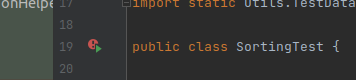
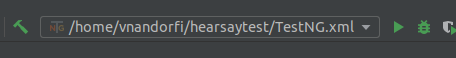
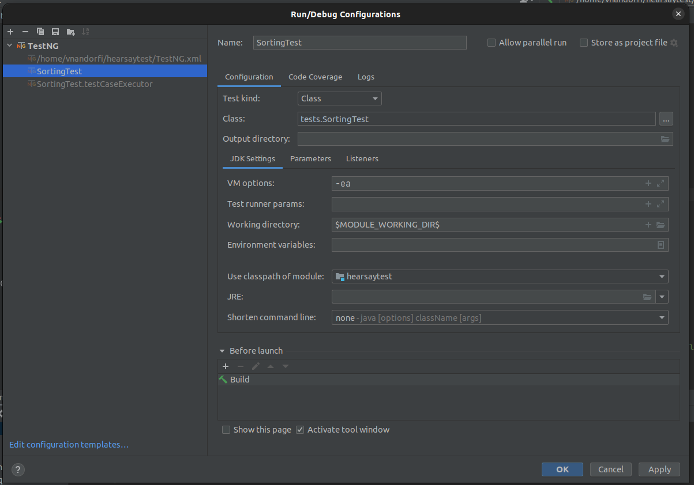

## Sorting test for Hearsay

Used technologies and principles:
* Java 11
* IntelliJ IDEA
* RestAssured
* SOLID
* Maven
* TestNG
* KISS
* Data/Parameter driven

### How to run?

### Using command line:

Open a terminal [Linux] or command line [windows] navigate to the hearsaytest folder and write into this command: 
```javascript
mvn clean test
```

##### Using IntelliJ IDEA:

Navigate to this file "SortingTest.java" in the left side project panel

Open this file "SortingTest.java"

Click on this small icon and select run.



OR

Open run configuration menu and set up as you see on my setup and then execute it.




OR

Right-click on the "TestNG.xml" file and select Run.

### Execution results as HTML report:
Can be found here:
```javascript
hearsaytest/test-output/html/index.html
or
hearsaytest/reports/test/html/index.html
or
hearsaytest/reports/test/emailable-report.html
or
hearsaytest/reports/test/index.html
```

### Execution results as CSV metric report:
Can be found here:
```javascript
hearsaytest/test_metrics.csv
```

